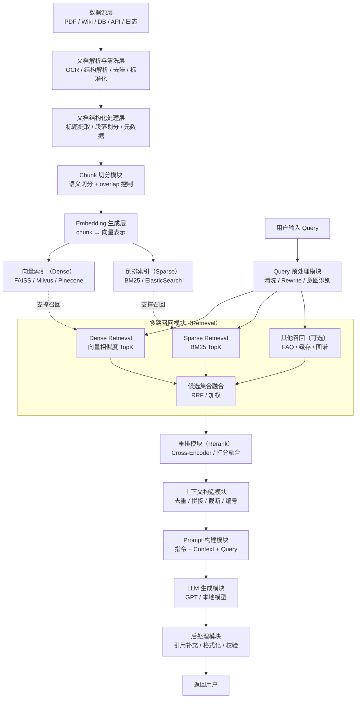

```mermaid
flowchart TD
    A["数据源层<br/>PDF / Wiki / DB / API / 日志"]
    B["文档解析与清洗层<br/>OCR / 结构解析 / 去噪 / 标准化"]
    C["文档结构化处理层<br/>标题提取 / 段落划分 / 元数据"]
    D["Chunk 切分模块<br/>语义切分 + overlap 控制"]
    E["Embedding 生成层<br/>chunk → 向量表示"]

    F["向量索引（Dense）<br/>FAISS / Milvus / Pinecone"]
    G["倒排索引（Sparse）<br/>BM25 / ElasticSearch"]

    H["用户输入 Query"]
    I["Query 预处理模块<br/>清洗 / Rewrite / 意图识别"]

    subgraph R["多路召回模块（Retrieval）"]
        R1["Dense Retrieval<br/>向量相似度 TopK"]
        R2["Sparse Retrieval<br/>BM25 TopK"]
        R3["其他召回（可选）<br/>FAQ / 缓存 / 图谱"]
        R4["候选集合融合<br/>RRF / 加权"]

        R1 --> R4
        R2 --> R4
        R3 --> R4
    end

    J["重排模块（Rerank）<br/>Cross-Encoder / 打分融合"]
    K["上下文构造模块<br/>去重 / 拼接 / 截断 / 编号"]
    L["Prompt 构建模块<br/>指令 + Context + Query"]
    M["LLM 生成模块<br/>GPT / 本地模型"]
    N["后处理模块<br/>引用补充 / 格式化 / 校验"]
    O["返回用户"]

    A --> B --> C --> D --> E
    E --> F
    E --> G

    H --> I
    I --> R1
    I --> R2
    I --> R3

    F -.支撑召回.-> R1
    G -.支撑召回.-> R2

    R4 --> J --> K --> L --> M --> N --> O
```